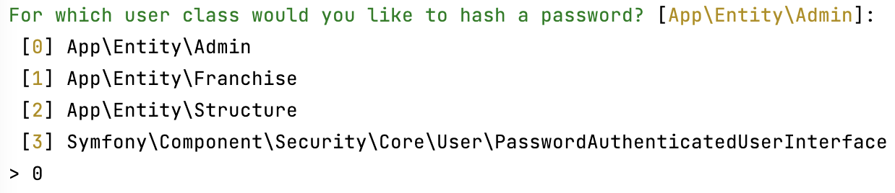
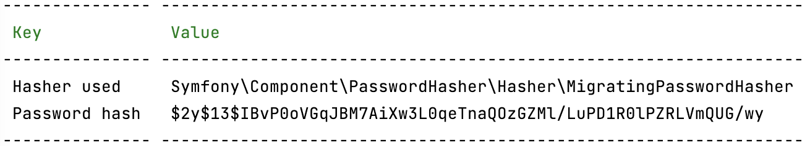
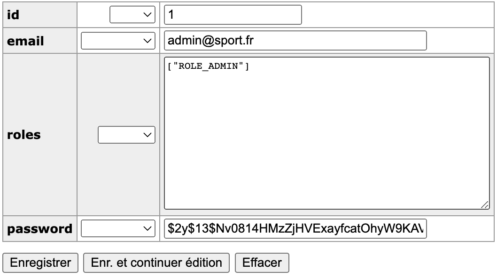

# ECF_12_2022

## Guide déploiement

### Première étape : Modification des variables

Dans votre fichier “.env” :

Modifier la valeur de “DATABASE_URL”
=> permet de renseigner les informations de votre BDD.

Pour plus d'information, aller
sur [Symfony - Configuring the database](https://symfony.com/doc/current/doctrine.html#configuring-the-database)

Modifier la valeur de “MAILER_DSN”
=> permet de renseigner les informations du smtp pour l’envoi des mails.

Pour plus d'informations, aller
sur [Symfony - Transport Setup](https://symfony.com/doc/current/mailer.html#transport-setup)

### Deuxième étape : Mise en liaison avec la BDD

Dans le terminal, faire la commande pour créer la base de données :

symfony console doctrine:database:create

Ensuite, faire la commande pour utiliser les fichiers de migrations existants :

symfony console doctrine:migrations:migrate
=> Pour plus d'information, aller
sur [Symfony - Migrations](https://symfony.com/doc/current/doctrine.html#migrations-creating-the-database-tables-schema)

Une fois cela fait, il faut créer un mot de passe hashé avec la commande :

Symfony console security:hash-password
=> Pour plus d'information, aller
sur [Symfony - Hashing Password](https://symfony.com/doc/current/security.html#registering-the-user-hashing-passwords)

Lors de l’exécution de cette commande, il faut choisir l'entité Admin, afin de créer le mot de passe du premier profil
administrateur.



Ensuite dans votre base de données, il faut créer un nouvel élément dans la table “admin”, en mettant ces valeurs :

email : l’email que vous utiliserez pour vous connecter

roles :

```json
  ["ROLE_ADMIN"]
```

ATTENTION DE BIEN METTRE DES GUILLEMENTS POUR RESPECTER LE FORMAT JSON

password : copier le mot de passe qui a été généré par la commande précédente. (Ligne "Password hash")



Voici le screen de ce que j'ai rentré dans ma base de données.


-------------------------------

## Manuel d'utilisation

Une fois tout cela fait, vous pouvez créer/modifier/consulter des franchises et des structures.
Pour toute création ou modification, il faut être administrateur.

### Création d’une franchise :

Il y a deux accès possibles, en allant par le menu, en appuyant sur “Création d’une franchise” ou par la “liste des
franchises” en appuyant sur le bouton “Créer une franchise”

Ensuite il suffit de remplir les données de votre franchise et de choisir les options. Puis de valider.

Un mail sera envoyé à l’adresse de la franchise pour créer le mot de passe du compte de cette dernière.

### Modification d’une franchise :

Il faut aller sur la “liste des franchises” puis appuyer sur le bouton “modifier la franchise” puis faire les
modifications et valider.

Un mail informatif est envoyé pour signaler d’un changement.

### Création d’une structure :

Il y a trois accès possibles, en allant par le menu, en appuyant sur “Création d’une structure” ou par la “liste des
franchises” en appuyant sur le bouton “Voir la franchise” puis sur le bouton “AJOUTER” ou sur le bouton “Créer une
nouvelle structure”.

Ensuite il suffit de remplir les données de votre structure et de choisir les options. Puis de valider.

Un mail sera envoyé à l’adresse de la franchise pour valider la création de la structure, le gérant de la franchise
devra se connecter puis un autre mail sera envoyé à l’adresse mail de la structure pour créer le mot de passe du compte
de cette dernière.

### Modification d’une franchise :

Il faut aller sur la “liste des franchises” et appuyer sur le bouton “Voir la franchise” puis appuyer sur le bouton
“modifier la franchise” et enfin faire les modifications et valider.
Un mail informatif est envoyé pour signaler d’un changement.

### Consultation des franchises/structures :

Pour consulter une franchise, il faut appuyer sur le lien "Listes des franchises", pour voir le détail de la franchise,
il faut appuyer sur le bouton de "Voir la franchise".
Sur cette page, il y a accès aux informations des structures et des franchises.
